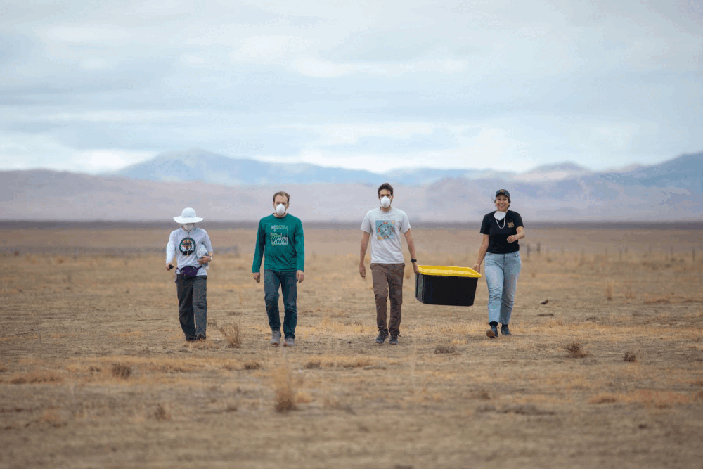
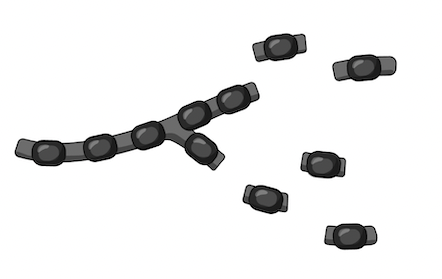
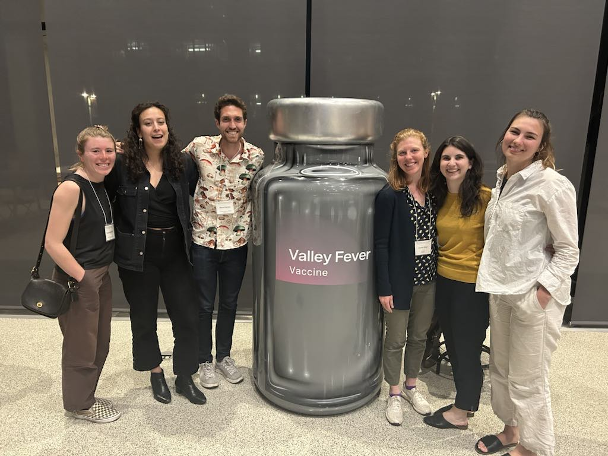
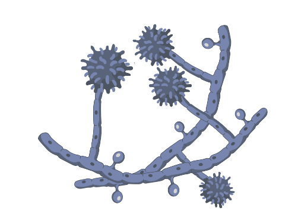
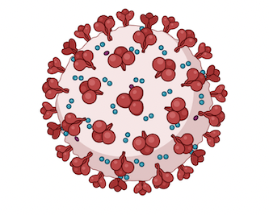

## {.tabset .tabset-pills}

### About

***

```{r, echo=FALSE, out.width="60%", fig.align = 'left'}

``` 

***

CSI-Michigan is an interdisciplinary research group located within the Department of Epidemiology at the University of Michigan. Our group applies mathematical and statistical models to understand the impact of climate, public health policies, and individual behaviors on infectious disease dynamics. A major focus of our work is on the emergence of fungal infections, including Valley fever (also known as coccidioidomycosis), blastomycosis, and histoplasmosis. Our work and methods cross multiple disciplines, including epidemiology, data science, econometrics, environmental health, and ecology. We collaborate with state and federal agencies to help convey findings into actionable public health outcomes.

<br>

<br>

```{r, echo=FALSE, out.width="50%", fig.align = 'center'}

``` 

<br>


### Research Projects

***
**The emergence of Valley fever in a changing climate**



Coccidioidomycosis, also called Valley fever, is a fungal disease caused by inhalation of soil-dwelling spores endemic to the southwestern US. Incidence has been increasing markedly in the American southwest, and environmental factors are likely at play. We work with the Remais and Taylor lab at UC Berkeley, recipients of an NIH R01 project, ["Integrating epidemiologic and environmental approaches to understand and predict Coccidioides exposure and coccidioidomycosis emergence"](https://reporter.nih.gov/search/rJKT6hvETUy8suWJ0QN6nA/project-details/10065493) to addresses gaps in our understanding of the kinds of dust exposures, and the environmental and social conditions, that increase the incidence of coccidioidomycosis in the southwest. We are examining the role of environmental conditions -- like drought and wildfires --  in the geographic expansion of the pathogen.

***
**Distribution of human-pathogenic fungi in environmental media (soil, air, zoonotic hosts)**


*Coccidioides*, the fungal pathogen that causes Valley fever, grows in the soil and becomes airborne. We are examining climate and zoonotic factors that influence its presence in soil and dispersal through air. Rodents may play an important role in the lifecycle of the *Coccidioides* fungus. We are conducting longitudinal soil surveillance within burrows and surface soils within the Carrizo Plain, in areas with rodents and without. The Carrizo Plain is endemic for the pathogen as well as home to a large population of the endangered kangaroo rat. This project was started under an NIH F31 grant, ["Elucidating the role of rodent hosts on transmission of coccidiodomycosis in California"](https://reporter.nih.gov/search/rQH2DRMYj0CoV0qQ0RiNIg/project-details/10216947). 
Separately, we are working with the US EPA to understand *Coccidioides* airborne dispersal using Unmanned Aircraft Systems (UAS). By affixing portable air sampling devices to uncrewed aircraft systems, we can detect aerosolized *Coccidioides* spores across a variety of landscapes and hard-to-reach locations, while simulataneously collected detailed geospatial information.

Bats are known hosts for *Histoplasma* spp., a fungal pathogens that cause histoplasmosis, and - to a lesser degree - can be infected with *Blastomyces* spp., a fungal pathogen that causes blastomycosis. Outbreaks of histoplasmosis are often associated with caves and bat guano, but it is unclear whether bats are carrying the fungus and depositing it via their feces or merely providing the proper nutrients for the fungus to grow in soils. We are investigating the distribution of *Histoplasma* and *Blastomyces* species in bats in Michigan.

<br>
<br>
<br>
<br>

***
**Population immunity to Valley fever and other endemic mycoses**



Despite its changing epidemiology, our most recent knowledge of immunity to Valley fever and other fungal infections is based on surveys from 1951. Cases ascertained by surveillance systems are believed to vastly undercount true incidence: CDC estimates nearly 150,000 cases of coccidioidomycosis go uncounted each year. Dr. Head is a recipient of an NIH K01 grant, "Modelled estimation of population immunity for coccidioidomycosis and the role of immunologically naive populations in the shifting epidemiology of coccidioidomycosis in California" to address this gap. This project will also develop new models to evaluate how population movement biases residence-based measures of association.

Incidence of Valley fever is disproportionately high among incarcerated populations. As part of this project, the group is also working with California Correctional Health Care Services to examine risk factors for the transmission of Valley fever and evaluate preventative measures among California's incarcerated residents. 

***
**Climate and other emerging fungal infections: histoplasmosis and blastomycosis**


Fungal infections endemic to the Midwest and eastern parts of the US include histoplasmosis and blastomycosis. These diseases may also be climate-sensitive and are changing their spatial distribution. Dr. Head is a co-I on an NIH R01 project to investigate the relationship between climatic factors and other fungal infections, leveraging massive electronic health record and Medicare datasets.

<br>
<br>

***
**COVID-19 transmission in pediatric populations**



Our group is interested in a variety of emerging infectious diseases. We are working with the California Department of Public Health to understand the influence of public health policies in schools on transmission attributable to in-person schooling. We use mathematical models and econometric designs to understand transmission dynamics. Some published modeling work can be seen [here](https://doi.org/10.1016/j.lana.2021.100133) and [here](https://doi.org/10.1098/rsif.2020.0970). We are also working to understand impact of pediatric vaccines on childhood COVID-19 rates.

<br>
<br>
<br>

***

<br>
<br>

```{r, echo=FALSE, out.width="50%", fig.align = 'center'}

``` 

### People

***

#### Current members

**Jennifer Head-Zhutenegger, PhD, MPH**: Lab PI

```{r, echo=FALSE, out.width="20%", fig.align = 'left'}

``` 

***

#### Current members

**Vanessa Slack**: Vanessa is a PhD student Epidemiology at the University of Michigan. 

**Sophia Kruger**: Sophia earned her MPH in Epidemiology from University of Michigan.

**Kelly Yan**: Kelly is an MPH student in Epidemiology at the University of Michigan.

**Zoe Brokering**: Zoe is an MPH student in Epidemiology at the University of Michigan.

**Carly Kallembach:** Carly is an MPH student in Environmental Health Sciences at the University of Michigan.

**Julia Hermann**: Julia is an MPH student in Epidemiology at the University of Michigan.

**Arundhati Rajan**: Aru is an MPH student in Biostatistics at the University of Michigan.

**Jack Ullman**: Jack is a senior in Ecology and Evolutionary Biology at the University of Michigan.

***

#### Previous members

**Sarah Dobson**: Sarah earned her MPH in Epidemiology from University of Michigan and now works at Centers for Disease Prevention and Control.

**Eve Lin**: Eve earned her B.S. in Computer Science from UC Berkeley and now works at Microsoft.

```{r, echo=FALSE, out.width="20%", fig.align = 'left'}

``` 


### News

***
**Print**

Our field and climate modeling work was highlighted in **Science News** [here](https://www.science.org/content/article/climate-change-may-be-driving-spread-deadly-fungus-u-s-southwest) and in **The Washington Post** [here](https://www.washingtonpost.com/climate-environment/interactive/2023/valley-fever-spread-climate-change-coccidioides-fungus/). These articles feature ongoing soil sampling to understand the fungus's association with rodent burrows, novel air sampling using UAS, and published work on the association between drought, precipitation, and Valley fever.

<br>

Our paper, [Effects of precipitation, heat, and drought on incidence and expansion of coccidioidomycosis in western USA: a longitudinal surveillance study](https://doi.org/10.1016/S2542-5196(22)00202-9), is featured in several articles, including:

- [Drought, flooding, drought again: Is ‘weather whiplash’ our new normal?](https://www.nationalgeographic.com/environment/article/weather-climate-whiplash-drought-floods-heat-wildfires) - *National Geographic*, Sept 18, 2024

- [Valley fever: Why the fungal disease is spreading into northern California](https://www.sfchronicle.com/health/article/climate-change-pushing-valley-fever-northward-18277182.php) - *San Fransciso Chronicle*, August 13, 2023

- [The battle against the fungal apocolypse is just beginning](https://www.wired.com/story/the-battle-against-the-fungal-apocalypse-is-just-beginning/?utm_source=twitter&utm_medium=social&mbid=social_tw_sci&utm_brand=wired-science&utm_social-type=owned) - *Wired*, August 25, 2023

- [As climate heats up, Valley fever spikes](https://www.mercurynews.com/2023/01/30/as-californias-climate-heats-up-valley-fever-spikes-especially-on-central-coast/) -  *The Mercury News*, January 30, 2023. This article was also featured on the front page of *The East Bay Times* and in the *Orange County Register*.

- [Climate change drives another outbreak: In California, it’s a spike in Valley fever cases](https://www.courthousenews.com/climate-change-drives-another-outbreak-in-california-its-a-spike-in-valley-fever-cases/) - *The Courthouse News*, October 5, 2022

- [Valley fever cases are on the rise as California’s drought worsens, a UC Berkeley study shows](https://localtoday.news/ca/valley-fever-cases-are-on-the-rise-as-californias-drought-worsens-a-uc-berkeley-study-shows-88354.html) - *Local Today*, October 11, 2022


<br>

We discuss how increasing drought may have contributed to the rise of coccidioidomycosis incidence in the Western US: [Climate Change is Spreading a Debilitating Fungal Disease Throughout the West](https://insideclimatenews.org/news/22042022/valley-fever-climate-change/) - *Inside Climate News*, April 23, 2022. 

<br>

We discuss evidence for the connection between wildfires and rising coccidioidomycosis incidence in California: [A deadly fungal disease on the rise in the West has experts worried](https://grist.org/health/valley-fever-rising-us-west-wildfires-cocci-fungus/) - *Grist*, Sept. 15, 2021. This story was also run by *Wired* [here](https://www.wired.com/story/valley-fever-is-spreading-through-a-hotter-drier-western-us/)

<br>

Our paper, "[School closures reduced social mixing of children during COVID-19 with implications for transmission risk and school reopening policies"](https://doi.org/10.1098/rsif.2020.0970), is featured in an [article](https://theconversation.com/reopening-elementary-schools-carries-less-covid-19-risk-than-high-schools-but-that-doesnt-guarantee-safety-144674) by  *The Conversation*, August 25, 2020, and *The Academic Times*, April 13, 2021

<br>

**Podcast**

Our field and climate modeling work was highlighted in a *Science News* podcast and can be listened to [here](https://www.science.org/content/podcast/rising-infections-dusty-devil-and-nailing-down-when-our-ancestors-became-meat-eaters)

Jennifer Head is interviewed by *JAMA Network Open* about recent paper, ["COVID-19 Incidence and Age Eligibility for Elementary School"](https://jamanetwork.com/journals/jamanetworkopen/fullarticle/2826171) . Listen [here](https://edhub.ama-assn.org/jn-learning/audio-player/18927475)

Jennifer Head is interviewed about Valley fever as part of SF Chronicle's Fifth & Mission Podcast. Listen [here](https://www.sfchronicle.com/podcasts/article/valley-fever-climate-change-18297408.php)

**Radio**

Dr. Head discusses what Valley fever is, and how the climate may be behind its rise in California in several radio shows, including:

- KNX Radio Los Angeles, October 5, 2022

- Radio Bilingue Spanish News, Crisis climatica dispara casos de fiebre del valle en California, October 28, 2022. [(Listen here)](http://radiobilingue.org/features/crisis-climatica-dispara-casos-de-fiebre-del-valle-en-california/)

- KCBS Bay Area Podcast, Series of wet and dry weather is causing a rise in cases of Valley Fever, January 31, 2023. [(Listen here)](https://www.audacy.com/kcbsradio/podcasts/kcbs-on-demand-20757/series-of-wet-and-dry-weather-is-causing-a-rise-in-cases-of-valley-fever-1552534668)


<br>
<br>

```{r, echo=FALSE, out.width="50%", fig.align = 'center'}

``` 


### Publications

***

See here for a list of publications in [Google Scholar](https://scholar.google.com/citations?user=PzF3BqQAAAAJ&hl=en&oi=ao)

***

**2025**

***

Weaver AK,  Keeney N, **Head JR**, Heaney AK, Camponuri SK, Collender P, Bhattachan A, Okin GS, Eisen EA, Sondermeyer-Cooksey G, Yu A, Vugia D, Jain S, Balmes J, Taylor J, Remais JV, Strickland MJ. Estimating the exposure-response relationship between fine mineral dust concentration and coccidioidomycosis incidence using speciated particulate matter data: A longitudinal surveillance study. *Environmental Health Perspectives* 133(1). https://ehp.niehs.nih.gov/doi/10.1289/EHP13875

**preprints**

**Head, JR**, Camponuri SK, Weaver AK, Montoya L, Lee E, Radosevich M, Jones I, Wagner R, Bhattachan A, Campbell G, Keeney N, Collender PA, Heaney AK, Couper L, Colvin KA, Larios L, Bean WT, Taylor JW, Remais JV. (2024). Small mammals and their burrows shape the distribution of Coccidioides in soils: evidence from a long-term ecological experiment in the Carrizo Plain National Monument, California, USA. *bioRXiv*. https://www.biorxiv.org/content/10.1101/2024.09.21.613892v1.full

Camponuri SK, Heaney AK, Sondermeyer Cooksey G, Vugia DJ, Jain S, Swain D, Balmes J, Remais JV, **Head, JR**. (2024). Recent and forecasted increases in coccidioidomycosis incidence in California linked to hydroclimatic swings. *medRXiv*. https://www.medrxiv.org/content/10.1101/2024.08.30.24312858v1

Radosevich MT, Dobson S, Weaver AK, Lampman PTA, Kollath DR, Couper L, Campbell G, Taylor JW, Remais JV, Kobziar L, Markwiese J, **Head, JR**. (2024). Detection of airborne Coccidioides spores using lightweight portable air samplers affixed to uncrewed aircraft systems in California's Central Valley. *bioRXiv*. https://www.biorxiv.org/content/10.1101/2024.10.28.620741v2

Camponuri SK, **Head, JR**, Collender PA, Weaver AK, Heaney AK, Colvin KA, Bhattachan A, Sondermeyer-Cooksey G, Vugia DJ, Jain S, Remais JV. (2024). Prolonged dry seasons lengthen coccidioidomycosis transmission seasons: implications for a changing California. *medRXiv*. https://www.medrxiv.org/content/10.1101/2024.10.22.24315941v1

***

**2024**

***

Lin E, Bilinski A, Collender PA, Lee V, Sud S, Leon TM, White LA, Remais JV, **Head JR**. Association of COVID-19 incidence with age eligibility for elementary school in California. *JAMA Network Open* 7(11), e2444836. https://doi.org/10.1001/jamanetworkopen.2024.44836

**Head JR**, Collender PA, Leon TM, White LA, Sud SR, Camponuri SK, Lee V, Lewnard JA, Remais JV. (2024). COVID-19 Vaccination and Incidence of Pediatric SARS-CoV-2 Infection and Hospitalization. *JAMA Network Open*. https://doi.org/10.1001/jamanetworkopen.2024.7822.

Heaney AK, Camponuri SK, **Head JR**, Collender PA, Weaver AK, Sondermeyer Cooksey G, Yu A, Vuigia D, Jain S, Bhattachan, A, Taylor JW, Remais JV. Coccidioidomycosis seasonality in California: a longitudinal surveillance study of the climate determinants and spatiotemporal variability of seasonal dynamics, 2000–2021. *Lancet Regional Health - Americas*. https://doi.org/10.1016/j.lana.2024.100864.

***

**2023**

***

Phillips S, Jones I, Sondermyer-Cooksey G, Yu A, Heaney AK, Zhou B, Bhattachan A, Mgbara W, Wagner R, Taylor J, Lettenmaier D, Okin G, Jain S, Vugia DJ, Remais JV, **Head JR**. (2023). Population-level association between wildfires and coccidioidomycosis cases in California, 2000-2018: a synthetic control analysis. *Environmental Epidemiology*. https://doi.org/10.1097/EE9.0000000000000254.

Wagner R, Montoya, L, **Head JR**, Campo S, Taylor JV, Taylor JW. (2023). *Coccidioides* undetected in agricultural soils and unassociated with time in undeveloped soils. *PLoS Pathogens*. https://doi.org/10.1371/journal.ppat.1011391 

Cheng Q, Jing Q, Collender PA, **Head JR**, Li Q, Yu H, Li Z, Ju Y, Chen T, Wang P, Cleary E, Lai S. (2023). Prior water availability modifies the effect of heavy rainfall on dengue transmission: a time series analysis of passive surveillance data from southern China. *Frontiers in Public Health*. https://doi.org/10.3389/fpubh.2023.1287678. 

Li C, Lum F, Chen EM, Collender PA, **Head JR**, Khurana RN, Cunningham Jr ET, Moorthy RS, Parke DW, McLeod SD. (2023). Shifts in ophthalmic care utilization during the COVID-19 pandemic in the US. *Communications Medicine*. https://doi.org/10.1038/s43856-023-00416-4

***

**2022**

***

Head JR, Sondermeyer-Cooksey G, Heaney AK, Yu AT, Jones I, Bhattachan A, Campo SK, Wagner R, Mgbara W, Phillips S, Keeney N, Taylor J, Eisen E, Lettenmaier DP, Hubbard A, Okin GS, Vugia DJ, Jain S, Remais JV. (2022). Effects of precipitation, heat, and drought on incidence and expansion of coccidioidomycosis in western USA: a longitudinal surveillance study. *Lancet Planetary Health*. https://doi.org/10.1016/S2542-5196(22)00202-9 

Head JR, Chanthavilay P, Catton H, Vongsitthi A, Khamphouxay K, Simphaly N. (2022). Changes in household food security, access to health services, and income in northern Lao PDR during the COVID-19 pandemic. *BMJ Open.* https://doi.org/10.1136/bmjopen-2021-055935

Andrejko KL, Head JR, Lewnard JA, Remais JV. (2022). Longitudinal social-contact patterns among school-aged children during the COVID-19 pandemic: The Bay Area Contacts among Kids (BACK) study. *BMC Infectious Diseases*. https://doi.org/10.1186/s12879-022-07218-4 

Weaver, AK, Head, JR, Gould, CF, Carlton, EJ, Remais, JV. (2022). Environmental factors influencing COVID-19 incidence and severity. *Annual Reviews in Public Health*. https://doi.org/10.1146/annurev-publhealth-052120-101420

Ross YB, Hoque M, Blanton JD, Kennedy ED, Rana MS, Tahmina S, Bonaparte S,Head JR, Wallace RM. (2022). Rabies healthcare-seeking behaviors of urban and peri-urban residents: Results from a rabies knowledge, attitudes, and practices survey, Bangladesh, 2018. *PLoS Neglected Tropical Diseases*. https://doi.org/10.1371/journal.pntd.0010634

Wagner R, Montoya L, Gao C, Head JR, Remais JV, Taylor JW. (2022). The air mycobiome is decoupled from the soil mycobiome in the California San Joaquin Valley. *Molecular Ecology*. https://doi.org/10.1111/mec.16640 

Yale G, Lopes M, Isloor S, Head JR, Mazeri S, Gamble L, Gongal G, Gibson AD. (2022). Review of oral rabies vaccination of dogs and its application in India. *Viruses*. https://doi.org/10.3390/v14010155 

Bryant-Genevier J, Bumburidi Y, Kazazian L, Seffren V, Head J, Berezovskiy D, Zhakipbayeva B, Salyer S, Knust B, Klena J, Chiang CF, Mirzabekova G, Rakhimov K, Koekeev J, Kartabayev K, Mamadaliyev S, Guerra M, Blanton C, Shoemaker T, Singer D, Moffett D. (2022). Prevalence of Crimean-Congo hemorrhagic fever virus among livestock and ticks in Zhambyl region, Kazakhstan, 2017. *American Journal of Tropical Medicine and Hygiene*. https://doi.org/10.4269/ajtmh.21-1092 

Cheng Q, Collender PA, Heaney AK, McLoughlin A, Yang Y, Zhang Y, Head JR, Dasan R, Liang S, Lv Q, Liu Y, Yang C, Chang HH, Waller LA, Zelner Jm Lewnard JA, Remais JV. (2022). Optimizing laboratory-based surveillance networks for monitoring multi-genotype or multi-serotype infections. *PLoS Computational Biology*. https://doi.org/10.1371/journal.pcbi.1010575

***
**2021**

***

Head JR, Andrejko KL, Remais JV. (2021). Model-based assessment of SARS-CoV-2 Delta variant transmission dynamics within partially vaccinated K-12 school populations. *The Lancet Regional Health-Americas*. https://doi.org/10.1016/j.lana.2021.100133

Head JR, Andrejko KL, Cheng Q, Collender PA, Phillips S, Boser A, et al. (2021). School closures reduced social mixing of children during COVID-19 with implications for transmission risk and school reopening policies. *Journal of the Royal Society Interface.* https://doi.org/10.1098/rsif.2020.0970

Heaney AK, Head JR, Broen K, Click K, Taylor J, Balmes JR, et al. (2021). Coccidioidomycosis and COVID-19 Co-Infection, United States, 2020. *Emerging infectious diseases*. https://doi.org/10.3201/eid2705.204661

Bumburidi Y, Utepbergenova G, Yerezhepov B, Berdiyarova N, Kulzhanova K, Head J, et al. (2021). Etiology of acute meningitis and encephalitis from hospital-based surveillance in South Kazakhstan oblast, February 2017—January 2018. *PloS one.* https://doi.org/10.1371/journal.pone.0251494

***
**2020**

***

Head JR, Collender PA, Lewnard JA, Skaff NK, Li L, Cheng Q, et al. (2020). Early evidence of inactivated enterovirus 71 vaccine impact against hand, foot, and mouth disease in a major center of ongoing transmission in China, 2011–2018: a longitudinal surveillance study. *Clinical Infectious Diseases*. https://doi.org/10.1093/cid/ciz1188

Head JR, Bumburidi Y, Mirzabekova G, Rakhimov K, Dzhumankulov M, Salyer SJ, et al. (2020). Risk Factors for and Seroprevalence of Tickborne Zoonotic Diseases among Livestock Owners, Kazakhstan. *Emerging infectious diseases.* https://doi.org/10.3201/eid2601.190220

Cheng Q, Trangucci R, Nelson KN, Fu W, Collender PA, Head JR, et al. (2020). Prenatal and early-life exposure to the Great Chinese Famine increased the risk of tuberculosis in adulthood across two generations. *Proceedings of the National Academy of Sciences.* https://doi.org/10.1073/pnas.2008336117

Skaff NK, Cheng Q, Clemesha RE, Collender PA, Gershunov A, Head JR, et al. (2020). Thermal thresholds heighten sensitivity of West Nile virus transmission to changing temperatures in coastal California. *Proceedings of the Royal Society B*. https://doi.org/10.1098/rspb.2020.1065

Gribble MO, Head JR, Prabhakaran D, Kapoor D, Garg V, Mohan D, et al. (2020). Potentially Heterogeneous Cross-Sectional Associations of Seafood Consumption with Diabetes and Glycemia in Urban South Asia. *International journal of environmental research and public health*. https://doi.org/10.3390/ijerph17020459.

Barbosa Costa G, Ludder F, Monroe B, Dilius P, Crowdis K, Blanton JD, et al. (2020). Barriers to attendance of canine rabies vaccination campaigns in Haiti, 2017. *Transboundary and emerging diseases*. https://doi.org/10.1111/tbed.13622

***
**2019**

***

Head JR, Vos A, Blanton J, Müller T, Chipman R, Pieracci EG, et al. (2019). Environmental distribution of certain modified live-virus vaccines with a high safety profile presents a low-risk, high-reward to control zoonotic diseases. *Scientific reports*. https://doi.org/10.1038/s41598-019-42714-9

Head J, Pachón H, Tadesse W, Tesfamariam M, Freeman M. (2019). Integration of water, sanitation, hygiene and nutrition programming is associated with lower prevalence of child stunting and fever in Oromia, Ethiopia. *African Journal of Food, Agriculture, Nutrition and Development*. https://doi.org/10.18697/ajfand.87.17785

Bumburidi Y, Moffett D, Head J, Utepbergenova G, Erezhepov B, Berdiyarova N, et al. (2019). Hospital-based surveillance for encephalitis and meningitis in South Kazakhstan oblast. *International Journal of Infectious Diseases.* https://doi.org/10.1371/journal.pone.0251494

***
**2018 - **

***

Head JR, Bumburidi Y, Salyer SJ, Knust B, Kuralbekovna MG, Moffett DB. (2018). Prevalence of CCHF Virus in Ticks and People and Public Awareness in Zhambyl Region, Kazakhstan. *Online Journal of Public Health Informatics* https://doi.org/10.5210/ojphi.v10i1.8951

Head JR, Chang H, Li Q, Hoover CM, Wilke T, Clewing C, et al. (2016). Genetic evidence of contemporary dispersal of the intermediate snail host of Schistosoma japonicum: movement of an NTD host is facilitated by land use and landscape connectivity. *PLoS neglected tropical diseases*. https://doi.org/10.1371/journal.pntd.0005151

Head JR, Getachew B, Gabrehiwot M. (2014). Harnessing local technology: Manufacturing small scale mixers for the fortification of edible oils and wheat flours in northern Ethiopia. *IEEE Global Humanitarian Technology Conference (GHTC 2014)* https://doi.org/10.1109/GHTC.2014.6970283

<br>
<br>

```{r, echo=FALSE, out.width="50%", fig.align = 'center'}

``` 

### Software
***

**Epidemiology Review**\
[https://jrhead.shinyapps.io/EpidemiologyReview/](https://jrhead.shinyapps.io/EpidemiologyReview/) \
*Open-source and interactive website featuring reviews of core concepts in epidemiology, interactive problems, and re-generative problem sets.*

**Assigning GPS points to administrative units**\
[https://jrhead.shinyapps.io/assignGEOIDs/](https://jrhead.shinyapps.io/assignGEOIDs/) \
*Open-source application for assigning GPS points to administrative GEOIDs.*

### Contact
***

<style>
div.blue { background-color:#e6f0ff; border-radius: 5px; padding: 20px;}
</style>
<div class = "blue">

Want to collaborate? Have questions? Find me here:

Email: jrhead@umich.edu

Twitter: @JenniferR_Head

</div>

<br>
<br>

```{r, echo=FALSE, out.width="30%", fig.cap="Two of my favorite things: dogs and redwoods", fig.align = 'center'}
knitr::include_graphics("D8H_6063.jpg")
```

<br>
<br>

```{r, echo=FALSE, out.width="50%", fig.align = 'center'}

``` 
