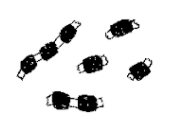

## Hi! I'm Jennifer {.tabset .tabset-pills}


### About Me


I'm a PhD Candidate in Epidemiology at the University of California Berkeley. I use mathematical and statistical models to understand the impact of public health policies, climate, and individual behaviors on infectious disease dynamics. I particularly focus on emerging, environmentally-mediated, or zoonotic diseases. My work utilizes both large surveillance datasets, as well as primary data collected from household questionnaires, anthrompometric measurements, and serosurveys. I think of myself first as an epidemiologist, but my work and methods cross multiple disciplines, including data science, econometrics, environmental health, and ecology. I collaborate with the California Department of Public Health to help convey findings into actionable public health outcomes.

### Current research

***
**Valley fever**
```{r, echo=FALSE, out.width="30%", fig.align = 'left'}

``` 

Coccidioidomycosis, or Valley fever, is a fungal disease caused by inhalation of soil-dwelling spores endemic to the southwestwern US. Incidence has been increasing markedly in the American southwest, and environmental factors are likely at play. The Remais and Taylor lab, are recipients of an NIH R01 project, ["Integrating epidemiologic and environmental approaches to understand and predict Coccidioides exposure and coccidioidomycosis emergence"](https://reporter.nih.gov/search/rJKT6hvETUy8suWJ0QN6nA/project-details/10065493) to addresses gaps in our understanding of the kinds of dust exposures, and the environmental and social conditions, that increase the incidence of coccidioidomycosis in the southwest. Using a G-computation ensemble modeling approach, I am examining the role that meterological factors, like drought, play in the geographic expansion of the pathogen. I am also examining the role of wildfires on transmission using a synthetic controls approach.

Rodents may play an important role in the lifecycle of the *Coccidioides* fungus. I have an NIH F31 grant, ["Elucidating the role of rodent hosts on transmission of coccidiodomycosis in California"](https://reporter.nih.gov/search/rQH2DRMYj0CoV0qQ0RiNIg/project-details/10216947), which examines the contribution of rodent hosts and burrows to habitats for *Coccidioides*. We are conducting longitudinal soil surveillance within burrows and surface soils within the Carrizo Plain, in areas with rodents and without. The Carrizo Plain is endemic for the pathogen as well as home to a large population of the endangered kangaroo rat. 

***
**COVID-19 transmission in schools**

```{r, echo=FALSE, out.width="20%", fig.align = 'left'}

``` 

I use mathematical models to understand the influence of public health policies in schools on transmission attributable to in-person schooling. Some of my modeling work can be seen [here](https://doi.org/10.1016/j.lana.2021.100133) and [here](https://doi.org/10.1098/rsif.2020.0970). I am also funded by a MIDAS Urgent Grant to conduct longitudinal surveys to measure social contacts among school children and their adult family members.

***
**Maternal and child nutrition**

```{r, echo=FALSE, out.width="20%", fig.align = 'left'}

``` 

I am a survey consultant for various NGO's, including Save the Children and CARE. I conduct and analyse household anthropometric surveys to evaluate programs that aim to improve nutritional and growth outcomes among women and children under five years.

***

### News

***
[Climate Change is Spreading a Debilitating Fungal Disease Throughout the West](https://insideclimatenews.org/news/22042022/valley-fever-climate-change/) - *Inside Climate News*, April 23, 2022

<br>

[A deadly fungal disease on the rise in the West has experts worried](https://grist.org/health/valley-fever-rising-us-west-wildfires-cocci-fungus/) - *Grist*, Sept. 15, 2021

<br>

Our paper, "[School closures reduced social mixing of children during COVID-19 with implications for transmission risk and school reopening policies"](https://doi.org/10.1098/rsif.2020.0970), is featured in an [article](https://theconversation.com/reopening-elementary-schools-carries-less-covid-19-risk-than-high-schools-but-that-doesnt-guarantee-safety-144674) by  *The Conversation*, August 25, 2020, and *The Academic Times*, April 13, 2021


### Publications

***
**Pre-prints:**

Head JR,Sondermeyer-Cooksey G, Heaney AK, Yu AT, Jones I, Bhattachan A, Campo SK, Wagner R, Mgbara W, Phillips S, Keeney N, Taylor J, Eisen E, Lettenmaier DP, Hubbard A, Okin GS, Vugia DJ, Jain S, Remais JV. [Influence of meteorological factors and drought on coccidioidomycosis incidence in California, 2000–2020](https://www.medrxiv.org/content/10.1101/2022.02.03.22270412v1) *medRxiv.*

Head JR, Chanthavilay P, Catton H, Vongsitthi A, Khamphouxay K, Simphaly N. [Changes in household food security, access to health services, and income in northern Lao PDR during the COVID-19 pandemic.](https://www.medrxiv.org/content/10.1101/2021.07.27.21261221v1) *medRxiv.* 


**Publications:**

Andrejko KL, Head JR, Lewnard JA, Remais JV. (2022). Longitudinal social-contact patterns among school-aged children during the COVID-19 pandemic: The Bay Area Contacts among Kids (BACK) study. **BMC Infectious Diseases**. https://doi.org/10.1186/s12879-022-07218-4 

Weaver, AK, Head, JR, Gould, CF, Carlton, EJ, Remais, JV. (2022). Environmental factors influencing COVID-19 incidence and severity. **Annual Reviews in Public Health**. https://doi.org/10.1146/annurev-publhealth-052120-101420

Yale G, Lopes M, Isloor S, Head JR, Mazeri S, Gamble L, Gongal G, Gibson AD. (2022). Review of oral rabies vaccination of dogs and its application in India. **Viruses**. https://doi.org/10.3390/v14010155 

Bryant-Genevier J, Bumburidi Y, Kazazian L, Seffren V, Head J, Berezovskiy D, Zhakipbayeva B, Salyer S, Knust B, Klena J, Chiang CF, Mirzabekova G, Rakhimov K, Koekeev J, Kartabayev K, Mamadaliyev S, Guerra M, Blanton C, Shoemaker T, Singer D, Moffett D. (2022). Prevalence of Crimean-Congo hemorrhagic fever virus among livestock and ticks in Zhambyl region, Kazakhstan, 2017. **American Journal of Tropical Medicine and Hygiene**. https://doi.org/10.4269/ajtmh.21-1092 

Head JR, Andrejko KL, Remais JV. (2021). Model-based assessment of SARS-CoV-2 Delta variant transmission dynamics within partially vaccinated K-12 school populations. *The Lancet Regional Health-Americas*. https://doi.org/10.1016/j.lana.2021.100133

Head JR, Andrejko KL, Cheng Q, Collender PA, Phillips S, Boser A, et al. (2021). School closures reduced social mixing of children during COVID-19 with implications for transmission risk and school reopening policies. *Journal of the Royal Society Interface.* https://doi.org/10.1098/rsif.2020.0970

Heaney AK, Head JR, Broen K, Click K, Taylor J, Balmes JR, et al. (2021). Coccidioidomycosis and COVID-19 Co-Infection, United States, 2020. *Emerging infectious diseases*. https://doi.org/10.3201/eid2705.204661

Bumburidi Y, Utepbergenova G, Yerezhepov B, Berdiyarova N, Kulzhanova K, Head J, et al. (2021). Etiology of acute meningitis and encephalitis from hospital-based surveillance in South Kazakhstan oblast, February 2017—January 2018. *PloS one.* https://doi.org/10.1371/journal.pone.0251494

Head JR, Collender PA, Lewnard JA, Skaff NK, Li L, Cheng Q, et al. (2020). Early evidence of inactivated enterovirus 71 vaccine impact against hand, foot, and mouth disease in a major center of ongoing transmission in China, 2011–2018: a longitudinal surveillance study. *Clinical Infectious Diseases*. https://doi.org/10.1093/cid/ciz1188

Head JR, Bumburidi Y, Mirzabekova G, Rakhimov K, Dzhumankulov M, Salyer SJ, et al. (2020). Risk Factors for and Seroprevalence of Tickborne Zoonotic Diseases among Livestock Owners, Kazakhstan. *Emerging infectious diseases.* https://doi.org/10.3201/eid2601.190220

Cheng Q, Trangucci R, Nelson KN, Fu W, Collender PA, Head JR, et al. (2020). Prenatal and early-life exposure to the Great Chinese Famine increased the risk of tuberculosis in adulthood across two generations. *Proceedings of the National Academy of Sciences.* https://doi.org/10.1073/pnas.2008336117

Skaff NK, Cheng Q, Clemesha RE, Collender PA, Gershunov A, Head JR, et al. (2020). Thermal thresholds heighten sensitivity of West Nile virus transmission to changing temperatures in coastal California. *Proceedings of the Royal Society B*. https://doi.org/10.1098/rspb.2020.1065

Gribble MO, Head JR, Prabhakaran D, Kapoor D, Garg V, Mohan D, et al. (2020). Potentially Heterogeneous Cross-Sectional Associations of Seafood Consumption with Diabetes and Glycemia in Urban South Asia. *International journal of environmental research and public health*. https://doi.org/10.3390/ijerph17020459.

Barbosa Costa G, Ludder F, Monroe B, Dilius P, Crowdis K, Blanton JD, et al. (2020). Barriers to attendance of canine rabies vaccination campaigns in Haiti, 2017. *Transboundary and emerging diseases*. https://doi.org/10.1111/tbed.13622

Head JR, Vos A, Blanton J, Müller T, Chipman R, Pieracci EG, et al. (2019). Environmental distribution of certain modified live-virus vaccines with a high safety profile presents a low-risk, high-reward to control zoonotic diseases. *Scientific reports*. https://doi.org/10.1038/s41598-019-42714-9

Head J, Pachón H, Tadesse W, Tesfamariam M, Freeman M. (2019). Integration of water, sanitation, hygiene and nutrition programming is associated with lower prevalence of child stunting and fever in Oromia, Ethiopia. *African Journal of Food, Agriculture, Nutrition and Development*. https://doi.org/10.18697/ajfand.87.17785

Bumburidi Y, Moffett D, Head J, Utepbergenova G, Erezhepov B, Berdiyarova N, et al. (2019). Hospital-based surveillance for encephalitis and meningitis in South Kazakhstan oblast. *International Journal of Infectious Diseases.* https://doi.org/10.1371/journal.pone.0251494

Head JR, Bumburidi Y, Salyer SJ, Knust B, Kuralbekovna MG, Moffett DB. (2018). Prevalence of CCHF Virus in Ticks and People and Public Awareness in Zhambyl Region, Kazakhstan. *Online Journal of Public Health Informatics* https://doi.org/10.5210/ojphi.v10i1.8951

Head JR, Chang H, Li Q, Hoover CM, Wilke T, Clewing C, et al. (2016). Genetic evidence of contemporary dispersal of the intermediate snail host of Schistosoma japonicum: movement of an NTD host is facilitated by land use and landscape connectivity. *PLoS neglected tropical diseases*. https://doi.org/10.1371/journal.pntd.0005151

Head JR, Getachew B, Gabrehiwot M. (2014). Harnessing local technology: Manufacturing small scale mixers for the fortification of edible oils and wheat flours in northern Ethiopia. *IEEE Global Humanitarian Technology Conference (GHTC 2014)* https://doi.org/10.1109/GHTC.2014.6970283

### Contact

<style>
div.blue { background-color:#e6f0ff; border-radius: 5px; padding: 20px;}
</style>
<div class = "blue">

Want to collaborate? Have questions? Find me here:

Email: jennifer_head@berkeley.edu

Twitter: @JenniferR_Head

</div>

<br>
<br>

```{r, echo=FALSE, out.width="30%", fig.cap="Two of my favorite things: dogs and redwoods", fig.align = 'center'}
knitr::include_graphics("D8H_6063.jpg")
```

