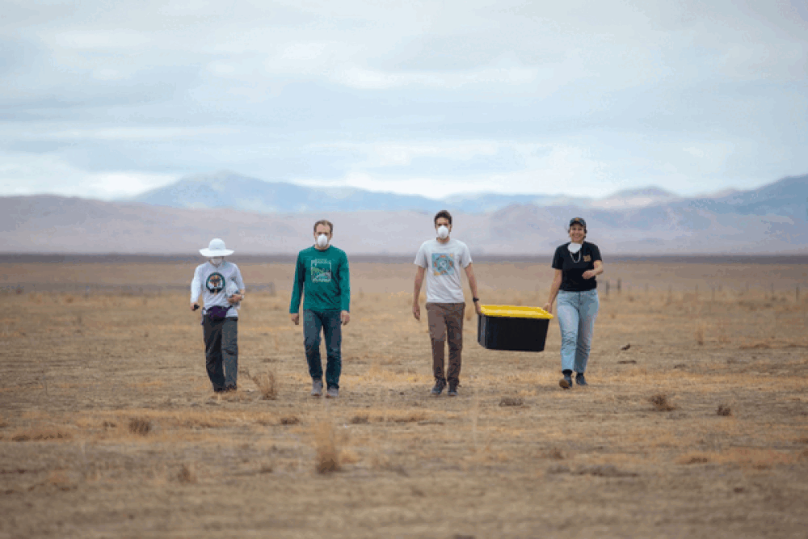
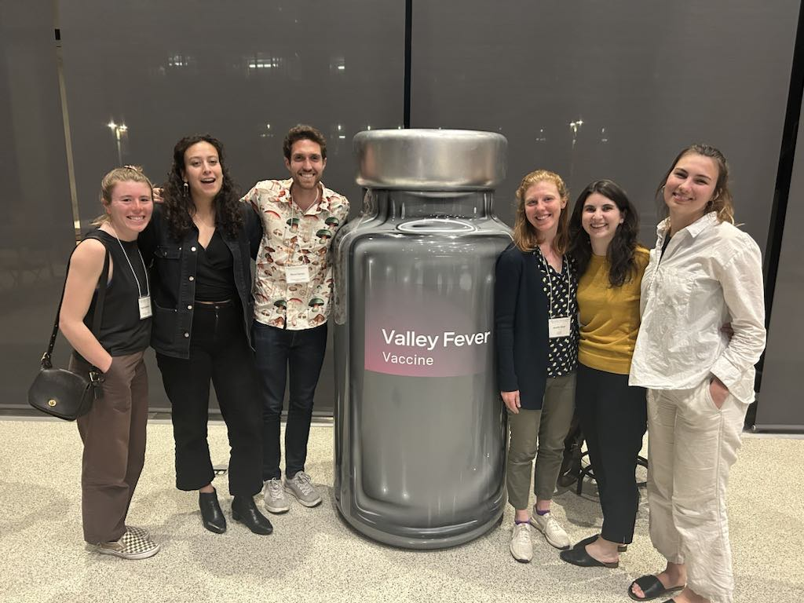
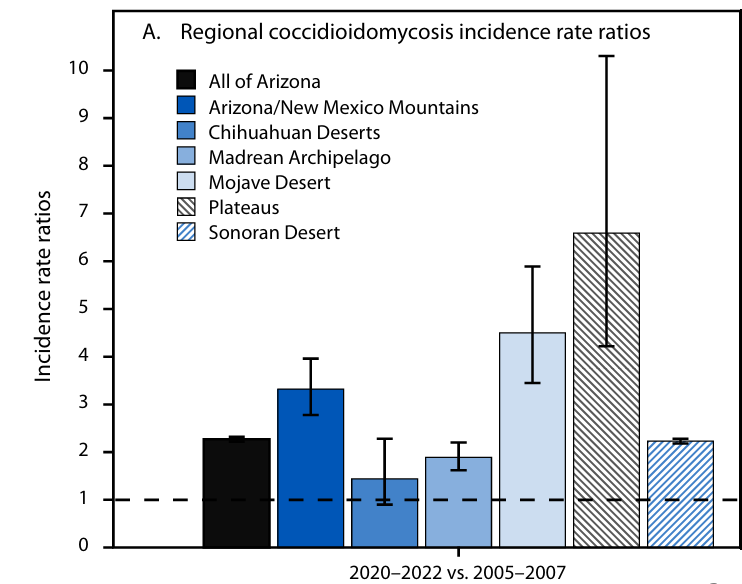
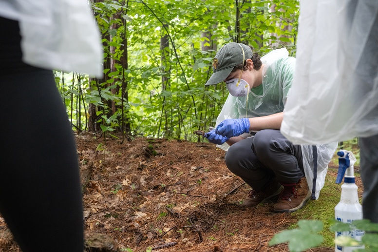
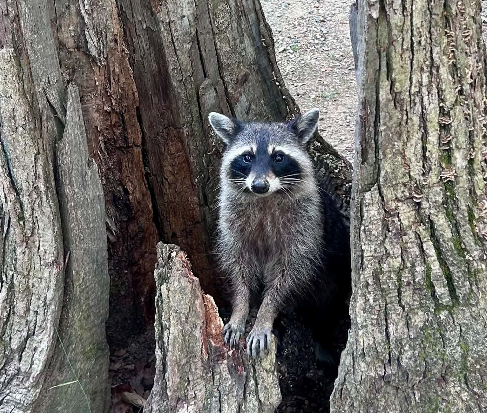
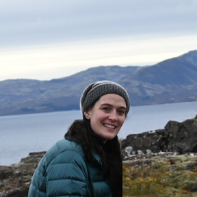
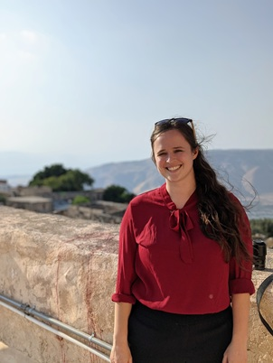

## {.tabset .tabset-pills}

### About

***

```{r, echo=FALSE, out.width="60%", fig.align = 'left'}

``` 

***

CSI-Michigan is an interdisciplinary research group located within the Department of Epidemiology at the University of Michigan. Our group applies mathematical and statistical models to understand the impact of climate, public health policies, and individual behaviors on infectious disease dynamics. A major focus of our work is on the emergence of fungal infections, including Valley fever (also known as coccidioidomycosis), blastomycosis, and histoplasmosis. Our work and methods cross multiple disciplines, including epidemiology, data science, econometrics, environmental health, and ecology. We collaborate with state and federal agencies to help convey findings into actionable public health outcomes.

<br>

<br>

```{r, echo=FALSE, out.width="50%", fig.align = 'center'}

``` 

<br>


### Research Projects

***
**Estimating population immunity to Valley fever**



Coccidioidomycosis, also called Valley fever, is a fungal disease caused by inhalation of soil-dwelling spores endemic to the southwestern US. Despite its changing epidemiology, our most recent knowledge of immunity to Valley fever is based on surveys from 1951. Cases ascertained by surveillance systems are believed to vastly undercount true incidence: CDC estimates nearly 150,000 cases of Valley fever go uncounted each year. Lack of data on population immunity obscures our understanding of the true burden of disease, hinders our understanding of the specific exposures that drive risk, and presents a challenge for planning vaccine trials. We are funded by an NIH R01 award ["Estimating and understanding implications of population susceptibility to coccidioidomycosis, an emerging infectious disease"](https://reporter.nih.gov/search/imXIdQ83-0mQHpdUF_gnmQ/project-details/11295039) to develop new approaches for understanding population immunity to Valley fever. We aim to: 1) advance methods for estimating immunity to Coccidioides in the general population using cell-mediated immunity (i.e., skin) tests and population-level serological surveys, and identify exposures associated with prior infection; 2) develop computational approaches to improve estimation of population-level immunity to Coccidioides and case under-reporting via the integration of data from surveillance, serology, and cell-mediated immunity tests; and 3) with an updated understanding of population immunity and case under- reporting, evaluate the risk factors and exposures that give rise to infection. This project involves both primary data collection - including via serosurveys and skin test surveys - and various statistical and mathematical modeling approaches.

***

**Understanding the emergence of Valley fever in a changing climate**



Incidence of Valley fever has been increasing markedly in the American southwest, and environmental factors are likely at play. We work with the Remais and Taylor lab at UC Berkeley (recipients of an NIH R01 award, ["Integrating epidemiologic and environmental approaches to understand and predict Coccidioides exposure and coccidioidomycosis emergence")](https://reporter.nih.gov/search/rJKT6hvETUy8suWJ0QN6nA/project-details/10065493) and the Heaney lab at UC San Diego (recipients of an NIH R21 award [Determining the effects of ambient dust exposure and extreme dust events on coccidioidomycosis in Arizona)](https://reporter.nih.gov/search/Yd2S7YpgWkGKP-WPEXK8kg/project-details/11374340) to addresses gaps in our understanding of the kinds of dust exposures, and the environmental and social conditions, that increase the incidence of coccidioidomycosis in the southwest. We are examining the role of environmental disturbances -- like drought, wildfires, and oil and gas drilling --  in the geographic expansion of the pathogen.

***
**Understanding the influence of climate and other environmental factors on blastomycosis**



Blastomycosis is a disease caused by inhalation of fungal spores of Blastomyces spp. that grow in soil or decaying wood. In the U.S., 57% of diagnosed cases are hospitalized and 8% die. The Great Lakes region has among the highest incidence rates of blastomycosis in the U.S., and annual case counts are rising rapidly. Via partnernship with Minnesota, Wisconsin, and Michigan state health departments, we seek to 1) understand how variation in precipitation and temperature influences blastomycosis incidence within the Great Lakes region and examine heterogeneity in this relationship by land cover and social vulnerability; 2) estimate the effect of extreme precipitation and flooding on blastomycosis incidence; and 3) determine the seasonality of blastomycosis and investigate how variation in precipitation and temperature explain seasonal timing and strength over space and time. This project is funded by an NIH R21 award, ["Understanding the influence of climate and other environmental factors on blastomycosis incidence and seasonality in northern Great Lakes states"](https://reporter.nih.gov/search/W9tsO19OMEiq_0WnUjdEFw/project-details/11231470).

***
**Understanding the impact of extreme weather on health outcomes nationally and in Detroit, MI**

Extreme weather events are increasing under climate change, causing adverse health outcomes among older adults and among Detroit residents. Using claims data, we are examining the health impacts of extreme precipitation and weather volatility among Medicare beneficiaries across the United States and examining interventions that may alleviate associated health burdens. We are also working locally to understand experiences with basement flooding in the Detroit area and identify policies that may reduce the impact of flooding on respiratory and mental health outcomes.

***
**Tracking HPAI H5N1 transmission among peridomestic mammals**



This [USDA-funded project](https://www.aphis.usda.gov/funding/highly-pathogenic-avian-influenza-hpai-poultry-innovation-grand-challenge) aims to understand the potential for sustained transmission of highly pathogenic avian influenza (HPAI) A H5N1 among wild mammals in areas with high poultry density and the risk of introduction from wild mammals to poultry, to inform biosecurity measures at the wildlifepoultry interface. Through partnership with various wildlife rehab centers and other organizations, we are assessing current and prior infection with H5N1 among wild terrestrial mammals. Using phylogenic and landscape analyses, we will examine transmission routes within peridomestic mammals to determine if HPAI H5N1 may be sustained in wild reservoirs via mammal-to-mammal transmission.

<br>
<br>

***
**Preventing Valley fever in California state prisons**

Incidence of Valley fever is disproportionately high among incarcerated populations. We are working with California Correctional Health Care Services to examine risk factors for the transmission of Valley fever and evaluate preventative measures among California's incarcerated residents. 

***
**Distribution of human-pathogenic fungi in environmental media (soil, air, zoonotic hosts)**


One research focus seeks to understand features that influence the environmental presence of endemic mycoses. We conduct environmental sampling for *Coccidioides*, *Histoplasma* and *Blastomyces* spp. All three fungal pathogens grow in the soil and become airborne and are capable of infecting other mammalian hosts. As some examples of our work, we are examining the distribution of *Blastomyces* spp. in soils collected from along the upper Wisconsin River to understand transient increases in the pathogen following flooding. We are conducting longitudinal soil surveillance within burrows and surface soils within the Carrizo Plain, in areas with rodents and without to understand the role of rodents in the lifecycle of the *Coccidioides* fungus. We have worked with the US EPA to understand *Coccidioides* airborne dispersal using Unmanned Aircraft Systems (UAS). Finally, we are investigating the distribution of *Histoplasma* infection in bats across Michigan to see if bats can be used to reveal human infection patterns.

***

```{r, echo=FALSE, out.width="50%", fig.align = 'center'}

``` 

### People

#### Current members

***

**Jennifer Head-Zhutenegger, PhD, MPH (PI)**


John G. Searle Assistant Professor of Epidemiology

Ph.D. Epidemiology, University of California Berkeley

MPH Global Environmental Health, Emory University

B.S Chemical Engineering, Washington University in St. Louis

*Email*: jrhead@umich.edu

<a href="Head_CV.pdf" download="Head_CV.pdf">full cirriculum vitae</a>

***

**Talia Sternbach, PhD, MSc (Postdoctoral Fellow)**


M-LEEaD 2026-27 Center Scientist

Ph.D. Epidemiology, McGill University

MSc Epidemiology, McGill University

B.A Environmental Science, McGill University

*Email*: talstern@umich.edu

*Research Interests*: Talia is interested in the health impacts of environmental exposures, like heavy rainfall and temperature, as well as environmental and social policies that may affect these exposures and drive health consequences. She is particularly interested in identifying intervention points along exposure-response pathways and applying impact evaluation methods to assess whether and how policies and other interventions reduce harmful exposures and improve population health. 

*Current research*: Her current work investigates how extreme precipitation and flooding affect disease risk at both national and local scales, including in Detroit, with a focus on identifying built and social environment factors that could mitigate this risk.

*Other interests*: Exploring outside - walking or biking around Ann Arbor, hiking, swimming - preferably with good coffee. 

***

**Vanessa Slack, MPH (Ph.D Candidate)**



Rackham Merit Fellow

MPH Epidemiology, Colorado School of Public Health

BS Zoology, Northern Michigan University

*Email*: vmslack@umich.edu

*Research Interests*: Zoonotic and emerging infectious diseases (rabies, parasites, fungal, and other zoonotic pathogens)

*Current research*: Blastomycosis in humans and dogs; Highly Pathogenic Avian Influenza (HPAI) H5N1 in mammals; and Histoplasmosis in bats

*Other interests*: Reading, knitting and crocheting, playing video games, and collecting mammalian skulls and skeletons. 

***

**Natalie Wodniak, MPH (Ph.D Candidate)**:


MPH Global Health Epidemiology and Disease Control, George Washington University

BA Environmental Studies & Humanitarian Studies, Fordham University

*Email*: nwodniak@umich.edu

*Research Interests*: Natalie is broadly interested in emerging and reemerging infectious disease epidemiology and global health security. Her research interests include strengthening disease surveillance and estimating burden of disease, causally evaluating the environmental drivers of infectious disease, and using mathematical modeling to understand transmission dynamics through a One Health perspective.

*Current research*: Natalie's current projects include: 1) an evaluation of flooding as a risk factor for blastomycosis infection in the Great Lakes region, 2) estimation of the rates of waning detection of coccidioidomycosis (Valley fever) infection by two assays, 3) estimating the burden of blastomycosis throughout the US, including in states that do not report surveillance data, and 4) exploring the burden of H5N1 influenza infection among peridomestic mammals and possible transmission mechanisms to birds and humans.

*Other interests*: Natalie lived and worked in Bangkok, Thailand for over 3 years. While living in SE Asia, she picked up the hobbies of outdoor rock climbing and scuba diving. She is passionate about marine conservation and is actively seeking her next conservation volunteer activity! At home, she enjoys spending time with her husband and two cats. She is an amateur birder and photographer, and uses birding as motivation to spend extra time outside, even in the cold Michigan winters. 

***

**Sophia Kruger, MPH (Research Associate Staff)**


MPH Global Health Epidemiology, University of Michigan

BS Biology of Global Health, University of St. Thomas

*Email*: sophik@umich.edu

*Research interests*: Sophia is interested in the influences of a changing climate on infectious disease trends, particularly the range expansion of environmentally driven diseases into susceptible populations. She is passionate about the applicability of harm reduction strategies in establishing interventions that advance health equity in the face of climate-driven health injustices. Sophia is also broadly interested in many topical public health concerns from the impacts of conventional agriculture on cancer rates to the effects of recreational drug decriminalization on overdose and usage rates, and she enjoys ruminating on how we communicate research on these issues to the general public. 

*Current projects:* Sophia works on projects seeking to 1) estimate and understand population immunity to coccidioidomycosis (Valley fever) in California and 2) determine the effects of lagged precipitation and temperature on coccidioidomycosis in Arizona. 

*Other interests:* Sophia loves touring art museums, farmers markets, parks, and supporting small businesses. She keeps up-to-date on the restaurant scene, wherever she is or might travel to, and picks new places to try on occasion. She always enjoys spending time cooking, baking, and cocktail-crafting for others, reading, and convening with nature (gardening, walking, sitting & staring), but she also cycles through new hobbies. Currently, she's enjoying card-making, crocheting/knitting, and (amateur) bird-watching!

***

**Julia Hermann, MPH (Research Associate Staff)**


MPH Hospital and Molecular Epidemiology, University of Michigan

BS Health Science, Boston University

*Email*: jnherm@umich.edu

*Research interests*: Julia is interested in infectious disease epidemiology, particularly zoonotic and environmentally-acquired diseases. She is passionate about understanding how the infectious disease landscape is changing, and will continue to change, in our evolving climate. Her other research interests center around how socioeconomic factors impact disease burden and the interaction between poverty and neglected tropical diseases. 

*Current projects*: Julia's current projects include: 1) a pilot serosurvey to determine the prevalence of potential exposure to Coccidioides in West Texas, 2) a broader study aimed at understanding population immunity to Valley fever in the western United States, 3) a project to understand the prevalence of HPAI H5N1 among peridomestic mammals, with the goal of aiding biosecurity efforts in the dairy and poultry industry

*Other interests*: Julia is a long-time Michigander! In her spare time, she likes to knit, read Stephen King and sci-fi books, and go to her local park to watch turtles.  

***

**Nate Truettner, MS (Research Associate)**


MS Computational Epidemiology and Systems Modeling, University of Michigan

BS Biology & Chemistry, University of Wisconsin-Madison

*Email*: ntruettn@umich.edu

*Research interests*: Infectious disease forecasting & genetic epidemiology

*Current projects:* Short-term forecasting of coccidioidomycosis incidence in Arizona using an ensemble modeling approach

*Other interests:*  Going to the movies, reading, video games, and doing things outdoors.

***

**Jamie Cooksey, MS (Research Associate)**



MS Animal Health and Welfare, Nottingham Trent University

BS Animal Science, Iowa University

*Email:* jcooksey@umich.edu

*Research interests*: One Health, animal health and the mechanisms driving emerging zoonotic disease transmission

*Current projects:* Investigating the links between rodents and *Coccidioides* transmission 

*Other interests:* Jamie loves traveling and has visited 13 countries and backpacked solo across Europe. Her hobbies include learning new hobbies, hiking, wildlife photography, videogames, and reading.  She loves coding and learning new coding languages, and built her own desktop computer. She also enjoys creative activities like painting, sewing, and stained-glass art. 

***

**Chris Bull (Graduate Research Assistant)**:


MS Computational Epidemiology and Systems Modeling, University of Michigan (ongoing)

BS Economics and Mathematical Methods in the Social Sciences, Northwestern University

*Email*: cwbull@umich.edu

*Research interests*: Chris is interested in applying quantitative approaches to understand how interactions between humans and their built and natural environments modulate infectious disease dynamics. He is particularly interested in understanding how new infectious disease risks may emerge under climate change, both as a direct result of sustained planetary warming and as a product of climate-induced patterns of human mobility and land use.

*Current projects:* Chris is characterizing climate and health relationships among older adults using national Medicare claims data. He leads work to understand associations between temperature volatility and mortality and supports work on extreme precipitation, flooding and respiratory infection.

*Other interests:* Playing and watching soccer, playing guitar, watching movies, and hiking.

***

**Emma Kohrt (Graduate Research Assistant)**:


MPH Epidemiology, University of Michigan (ongoing)

BS Health Sciences, Northeastern University

*Email*: ekohrt@umich.edu

*Research interests*: Infectious disease epidemiology, pharmacoepidemiology, real-world evidence, and health outcomes research

*Current projects:* Investigating nationwide trends in fungal infection (blastomycosis, histoplasmosis, coccidioidomycosis) incidence from 2006 to 2021 using Medicare claims data.

*Other interests:* Emma is originally from Connecticut and loves spending time outdoors, especially going to the beach and exploring new places! In her free time, she also enjoys reading, catching up on reality TV, and trying out new coffee shops.

***

**Emilia Yu (Graduate Research Assistant)**:


MPH Epidemiology, University of Michigan (ongoing)

BA Economics, New York University

*Email*: emiliayu@umich.edu

*Research interests*: Infectious disease, social epidemiology, mental health

*Current projects:* Mixed-methods study of the effects of extreme weather on health

*Other interests:* Emilia is originally from Pennsylvania but lived in New York City for over a decade before coming to Ann Arbor for school! She enjoys listening to and playing music, playing video games and Dungeons and Dragons, and exploring the local food scene.  

***

**Samantha McDonough (Graduate Research Assistant)**:

MPH Epidemiology, University of Michigan (ongoing)

BS Microbial Biology, University of California Berkeley

*Email*:

*Research interests*:

*Current projects:*

*Other interests:*

***

**Vianey Cardiel (Graduate Research Assistant)**:


MPH Epidemiology, University of Michigan (ongoing)

BS Nueroscience, University of Michigan

*Email*: vcardiel@umich.edu

*Research interests*: Climate change, human-animal-ecosystem disease interactions, and wildlife conservation

*Current projects:* Laboratory analysis of soil samples for *Blastomyces*  

*Other interests:* Vianey enjoys hiking, drawing, cooking, and finding new shows to watch. She volunteers at the Huron Valley Animal Society in her spare time and has isopods and fish as pets!

***

#### Previous members

**Violette Bonvalet**: MS, Computational Epidemiology & Systems Modelling

**Kelly Yan**: MPH, Epidemiology

**Zoe Brokering**: MPH, Epidemiology

**Carly Kallembach:** MPH, Environmental Health Sciences

**Arundhati Rajan**: MPH, Biostatistics

**Nidhi Remesh**: MPH, Hospital and Molecular Epidemiology

**Jack Ullman**: BS, Ecology and Evolutionary Biology

**Sarah Dobson**: MPH, Epidemiology

**Rachael Brooks**: MPH, Epidemiology

**Eve Lin**: BS, Computer Science (UC Berkeley)

### Publications

***

Select publications that best represent the group are below. See a full list of publications in [Google Scholar](https://scholar.google.com/citations?user=PzF3BqQAAAAJ&hl=en&oi=ao)

***

**2026**

***
Couper LI, Gonzalez DJX, Camponuri SK, Weaver AK, Sondermeyer Cooksey GL, Vugia D, Jain S, Taylor J, Balmes J, Eisen EA, Remias JV, **Head JR** (2026). Oil and gas well development and coccidioidomycosis risk in Kern County, CA, USA: a case-crossover study. *Lancet Planetary Health*. https://doi.org/10.1016/j.lanplh.2026.101521

**Head JR** and Heaney AK (2026). Emergence of Human Pathogenic Fungi in a Changing Climate. *Nature Reviews Microbiology*. https://doi.org/10.1038/s41579-026-01345-4

**Head JR**, Brouwer AF, Rajan A, Scherer M, Williams M, Balmes J, Thompson GR, Ampel ND, Lucas KD, (2026). Coccidioides skin test performance and patterns of prior immunity to coccidioidomycosis among a large population of males entering California state prisons, 2015–2024: a population-based modelling study. *Lancet Regional Health Americas* 58:101461. https://doi.org/10.1016/j.lana.2026.101461

Kruger S, Ruberto I, Williamson T, Remais JV, Heaney AK, **Head JR**, (2026). Regional increases in coccidioidomycosis incidence—Arizona, 2005-2022 *Morbidity and Mortality Weekly Report* 75(6). http://dx.doi.org/10.15585/mmwr.mm7506a3

**Head, JR**, Camponuri SK, Weaver AK, Montoya L, Lee E, Radosevich M, Jones I, Wagner R, Bhattachan A, Campbell G, Keeney N, Collender PA, Heaney AK, Couper L, Colvin KA, Larios L, Bean WT, Taylor JW, Remais JV. (2026). Small mammals and their burrows shape the distribution of Coccidioides in soils: evidence from a long-term ecological experiment in the Carrizo Plain National Monument, California, USA. *Ecology* 

Couper LI, Gonzalez DJX, Camponuri SK, Weaver AK, Sondermeyer Cooksey G, Vugia D, Jain S, Taylor J, Balmes J, Eisen EA, Remais JV, **Head, JR**, (2026). Oil and gas well development and coccidioidomycosis risk in California: A case-crossover study. *Lancet Planetary Health* 

Hermann JN, Kruger SE, Wodniak N, Holland J, Janosick V, Sanchez A, Zuniga-Moya JC, Brucker D, Torres B, Melo KM, Oliveros E, Kuran R, D’Assumpcao C, Johnson RH, Van Pelt RS, Bhattachan B, Wagner AL, **Head JR** (2026). Intent to Accept a Valley Fever Vaccine for Humans and Dogs and Factors Influencing Intended Uptake: A Cross-Sectional Survey in Two Endemic Regions *Journal of Fungi* 12(6), 420. https://doi.org/10.3390/jof12060420

***

**2025**

***

Weaver AK,  Keeney N, **Head JR**, Heaney AK, Camponuri SK, Collender P, Bhattachan A, Okin GS, Eisen EA, Sondermeyer-Cooksey G, Yu A, Vugia D, Jain S, Balmes J, Taylor J, Remais JV, Strickland MJ. Estimating the exposure-response relationship between fine mineral dust concentration and coccidioidomycosis incidence using speciated particulate matter data: A longitudinal surveillance study. *Environmental Health Perspectives* 133(1). https://ehp.niehs.nih.gov/doi/10.1289/EHP13875 

Camponuri SK, Heaney AK, Sondermeyer Cooksey G, Vugia DJ, Jain S, Swain D, Balmes J, Remais JV, **Head, JR**. (2025). Recent and forecasted increases in coccidioidomycosis incidence in California linked to hydroclimatic swings. *Emerging Infectious Diseases* 31(5): 1028 - 1032. https://doi.org/10.3201/eid3105.241338 

Radosevich MT, Dobson S, Weaver AK, Lampman PTA, Kollath DR, Couper L, Campbell G, Taylor JW, Remais JV, Kobziar L, Markwiese J, **Head, JR**. (2024). Detection of airborne Coccidioides spores using lightweight portable air samplers affixed to uncrewed aircraft systems in California's Central Valley. *Environmental Science & Technology Letters* 12 (5): 580–586. https://doi.org/10.1021/acs.estlett.4c01089

Bartels JGE,Camponuri SK, Snow TT, Bustamante BLM, Kane NJ, Reynolds RM, Lee A, Hoffman MA, White TC, Remais JV, **Head JR**. (2025). Updating the epidemiology of blastomycosis and histoplasmosis in the United States, using national electronic health record data, 2013–2023. *The Journal of Infectious Diseases* 232(6):e1048-e1059 https://doi.org/10.1093/infdis/jiaf472

Brooks RA, Yan K, **Head JR**. (2025). Assessment of prior infection with histoplasmosis using skin test and serological surveys: a global systematic review. *Open Forum Infectious Diseases* 12(8): ofaf437. https://doi.org/10.1093/ofid/ofaf437

Bartels JGE, **Head JR**, Camponuri SK, Eisen EA. (2025). Valley Fever Is an Occupational Illness: Let's Get the Data to Prevent It. *American Journal of Industrial Medicine* 68(11):929-932. https://doi.org/10.1002/ajim.70017

Camponuri SK, **Head, JR**, Collender PA, Weaver AK, Heaney AK, Colvin KA, Bhattachan A, Sondermeyer-Cooksey G, Vugia DJ, Jain S, Remais JV. (2024). Prolonged coccidioidomycosis transmission seasons in a warming California: a Markov state transition model of shifting disease dynamics. *Journal Royal Society Interface*. 22 (223): 20240821. https://doi.org/10.1098/rsif.2024.0821

***

**2024**

***

Lin E, Bilinski A, Collender PA, Lee V, Sud S, Leon TM, White LA, Remais JV, **Head JR**. Association of COVID-19 incidence with age eligibility for elementary school in California. *JAMA Network Open* 7(11), e2444836. https://doi.org/10.1001/jamanetworkopen.2024.44836

**Head JR**, Collender PA, Leon TM, White LA, Sud SR, Camponuri SK, Lee V, Lewnard JA, Remais JV. (2024). COVID-19 Vaccination and Incidence of Pediatric SARS-CoV-2 Infection and Hospitalization. *JAMA Network Open*. https://doi.org/10.1001/jamanetworkopen.2024.7822.

Heaney AK, Camponuri SK, **Head JR**, Collender PA, Weaver AK, Sondermeyer Cooksey G, Yu A, Vuigia D, Jain S, Bhattachan, A, Taylor JW, Remais JV. Coccidioidomycosis seasonality in California: a longitudinal surveillance study of the climate determinants and spatiotemporal variability of seasonal dynamics, 2000–2021. *Lancet Regional Health - Americas*. https://doi.org/10.1016/j.lana.2024.100864.

***

**2023**

***

Phillips S, Jones I, Sondermyer-Cooksey G, Yu A, Heaney AK, Zhou B, Bhattachan A, Mgbara W, Wagner R, Taylor J, Lettenmaier D, Okin G, Jain S, Vugia DJ, Remais JV, **Head JR**. (2023). Population-level association between wildfires and coccidioidomycosis cases in California, 2000-2018: a synthetic control analysis. *Environmental Epidemiology*. https://doi.org/10.1097/EE9.0000000000000254.

Wagner R, Montoya, L, **Head JR**, Campo S, Taylor JV, Taylor JW. (2023). *Coccidioides* undetected in agricultural soils and unassociated with time in undeveloped soils. *PLoS Pathogens*. https://doi.org/10.1371/journal.ppat.1011391 

Cheng Q, Jing Q, Collender PA, **Head JR**, Li Q, Yu H, Li Z, Ju Y, Chen T, Wang P, Cleary E, Lai S. (2023). Prior water availability modifies the effect of heavy rainfall on dengue transmission: a time series analysis of passive surveillance data from southern China. *Frontiers in Public Health*. https://doi.org/10.3389/fpubh.2023.1287678. 

Li C, Lum F, Chen EM, Collender PA, **Head JR**, Khurana RN, Cunningham Jr ET, Moorthy RS, Parke DW, McLeod SD. (2023). Shifts in ophthalmic care utilization during the COVID-19 pandemic in the US. *Communications Medicine*. https://doi.org/10.1038/s43856-023-00416-4

***

**2022**

***

Head JR, Sondermeyer-Cooksey G, Heaney AK, Yu AT, Jones I, Bhattachan A, Campo SK, Wagner R, Mgbara W, Phillips S, Keeney N, Taylor J, Eisen E, Lettenmaier DP, Hubbard A, Okin GS, Vugia DJ, Jain S, Remais JV. (2022). Effects of precipitation, heat, and drought on incidence and expansion of coccidioidomycosis in western USA: a longitudinal surveillance study. *Lancet Planetary Health*. https://doi.org/10.1016/S2542-5196(22)00202-9 

Head JR, Chanthavilay P, Catton H, Vongsitthi A, Khamphouxay K, Simphaly N. (2022). Changes in household food security, access to health services, and income in northern Lao PDR during the COVID-19 pandemic. *BMJ Open.* https://doi.org/10.1136/bmjopen-2021-055935

Andrejko KL, Head JR, Lewnard JA, Remais JV. (2022). Longitudinal social-contact patterns among school-aged children during the COVID-19 pandemic: The Bay Area Contacts among Kids (BACK) study. *BMC Infectious Diseases*. https://doi.org/10.1186/s12879-022-07218-4 

Weaver, AK, Head, JR, Gould, CF, Carlton, EJ, Remais, JV. (2022). Environmental factors influencing COVID-19 incidence and severity. *Annual Reviews in Public Health*. https://doi.org/10.1146/annurev-publhealth-052120-101420

Ross YB, Hoque M, Blanton JD, Kennedy ED, Rana MS, Tahmina S, Bonaparte S,Head JR, Wallace RM. (2022). Rabies healthcare-seeking behaviors of urban and peri-urban residents: Results from a rabies knowledge, attitudes, and practices survey, Bangladesh, 2018. *PLoS Neglected Tropical Diseases*. https://doi.org/10.1371/journal.pntd.0010634

Wagner R, Montoya L, Gao C, Head JR, Remais JV, Taylor JW. (2022). The air mycobiome is decoupled from the soil mycobiome in the California San Joaquin Valley. *Molecular Ecology*. https://doi.org/10.1111/mec.16640 

Yale G, Lopes M, Isloor S, Head JR, Mazeri S, Gamble L, Gongal G, Gibson AD. (2022). Review of oral rabies vaccination of dogs and its application in India. *Viruses*. https://doi.org/10.3390/v14010155 

Bryant-Genevier J, Bumburidi Y, Kazazian L, Seffren V, Head J, Berezovskiy D, Zhakipbayeva B, Salyer S, Knust B, Klena J, Chiang CF, Mirzabekova G, Rakhimov K, Koekeev J, Kartabayev K, Mamadaliyev S, Guerra M, Blanton C, Shoemaker T, Singer D, Moffett D. (2022). Prevalence of Crimean-Congo hemorrhagic fever virus among livestock and ticks in Zhambyl region, Kazakhstan, 2017. *American Journal of Tropical Medicine and Hygiene*. https://doi.org/10.4269/ajtmh.21-1092 

Cheng Q, Collender PA, Heaney AK, McLoughlin A, Yang Y, Zhang Y, Head JR, Dasan R, Liang S, Lv Q, Liu Y, Yang C, Chang HH, Waller LA, Zelner Jm Lewnard JA, Remais JV. (2022). Optimizing laboratory-based surveillance networks for monitoring multi-genotype or multi-serotype infections. *PLoS Computational Biology*. https://doi.org/10.1371/journal.pcbi.1010575

***
**2021**

***

Head JR, Andrejko KL, Remais JV. (2021). Model-based assessment of SARS-CoV-2 Delta variant transmission dynamics within partially vaccinated K-12 school populations. *The Lancet Regional Health-Americas*. https://doi.org/10.1016/j.lana.2021.100133

Head JR, Andrejko KL, Cheng Q, Collender PA, Phillips S, Boser A, et al. (2021). School closures reduced social mixing of children during COVID-19 with implications for transmission risk and school reopening policies. *Journal of the Royal Society Interface.* https://doi.org/10.1098/rsif.2020.0970

Heaney AK, Head JR, Broen K, Click K, Taylor J, Balmes JR, et al. (2021). Coccidioidomycosis and COVID-19 Co-Infection, United States, 2020. *Emerging infectious diseases*. https://doi.org/10.3201/eid2705.204661

Bumburidi Y, Utepbergenova G, Yerezhepov B, Berdiyarova N, Kulzhanova K, Head J, et al. (2021). Etiology of acute meningitis and encephalitis from hospital-based surveillance in South Kazakhstan oblast, February 2017—January 2018. *PloS one.* https://doi.org/10.1371/journal.pone.0251494

***
**2020**

***

Head JR, Collender PA, Lewnard JA, Skaff NK, Li L, Cheng Q, et al. (2020). Early evidence of inactivated enterovirus 71 vaccine impact against hand, foot, and mouth disease in a major center of ongoing transmission in China, 2011–2018: a longitudinal surveillance study. *Clinical Infectious Diseases*. https://doi.org/10.1093/cid/ciz1188

Head JR, Bumburidi Y, Mirzabekova G, Rakhimov K, Dzhumankulov M, Salyer SJ, et al. (2020). Risk Factors for and Seroprevalence of Tickborne Zoonotic Diseases among Livestock Owners, Kazakhstan. *Emerging infectious diseases.* https://doi.org/10.3201/eid2601.190220

Cheng Q, Trangucci R, Nelson KN, Fu W, Collender PA, Head JR, et al. (2020). Prenatal and early-life exposure to the Great Chinese Famine increased the risk of tuberculosis in adulthood across two generations. *Proceedings of the National Academy of Sciences.* https://doi.org/10.1073/pnas.2008336117

Skaff NK, Cheng Q, Clemesha RE, Collender PA, Gershunov A, Head JR, et al. (2020). Thermal thresholds heighten sensitivity of West Nile virus transmission to changing temperatures in coastal California. *Proceedings of the Royal Society B*. https://doi.org/10.1098/rspb.2020.1065

Gribble MO, Head JR, Prabhakaran D, Kapoor D, Garg V, Mohan D, et al. (2020). Potentially Heterogeneous Cross-Sectional Associations of Seafood Consumption with Diabetes and Glycemia in Urban South Asia. *International journal of environmental research and public health*. https://doi.org/10.3390/ijerph17020459.

Barbosa Costa G, Ludder F, Monroe B, Dilius P, Crowdis K, Blanton JD, et al. (2020). Barriers to attendance of canine rabies vaccination campaigns in Haiti, 2017. *Transboundary and emerging diseases*. https://doi.org/10.1111/tbed.13622

***
**2019**

***

Head JR, Vos A, Blanton J, Müller T, Chipman R, Pieracci EG, et al. (2019). Environmental distribution of certain modified live-virus vaccines with a high safety profile presents a low-risk, high-reward to control zoonotic diseases. *Scientific reports*. https://doi.org/10.1038/s41598-019-42714-9

Head J, Pachón H, Tadesse W, Tesfamariam M, Freeman M. (2019). Integration of water, sanitation, hygiene and nutrition programming is associated with lower prevalence of child stunting and fever in Oromia, Ethiopia. *African Journal of Food, Agriculture, Nutrition and Development*. https://doi.org/10.18697/ajfand.87.17785

Bumburidi Y, Moffett D, Head J, Utepbergenova G, Erezhepov B, Berdiyarova N, et al. (2019). Hospital-based surveillance for encephalitis and meningitis in South Kazakhstan oblast. *International Journal of Infectious Diseases.* https://doi.org/10.1371/journal.pone.0251494

***
**2018 - **

***

Head JR, Bumburidi Y, Salyer SJ, Knust B, Kuralbekovna MG, Moffett DB. (2018). Prevalence of CCHF Virus in Ticks and People and Public Awareness in Zhambyl Region, Kazakhstan. *Online Journal of Public Health Informatics* https://doi.org/10.5210/ojphi.v10i1.8951

Head JR, Chang H, Li Q, Hoover CM, Wilke T, Clewing C, et al. (2016). Genetic evidence of contemporary dispersal of the intermediate snail host of Schistosoma japonicum: movement of an NTD host is facilitated by land use and landscape connectivity. *PLoS neglected tropical diseases*. https://doi.org/10.1371/journal.pntd.0005151

Head JR, Getachew B, Gabrehiwot M. (2014). Harnessing local technology: Manufacturing small scale mixers for the fortification of edible oils and wheat flours in northern Ethiopia. *IEEE Global Humanitarian Technology Conference (GHTC 2014)* https://doi.org/10.1109/GHTC.2014.6970283

<br>
<br>

```{r, echo=FALSE, out.width="50%", fig.align = 'center'}

``` 

### News

***
**Print**

Our field and climate modeling work was highlighted in **Science News** [here](https://www.science.org/content/article/climate-change-may-be-driving-spread-deadly-fungus-u-s-southwest) and in **The Washington Post** [here](https://www.washingtonpost.com/climate-environment/interactive/2023/valley-fever-spread-climate-change-coccidioides-fungus/). These articles feature ongoing soil sampling to understand the fungus's association with rodent burrows, novel air sampling using UAS, and published work on the association between drought, precipitation, and Valley fever.

<br>

Our paper, [Effects of precipitation, heat, and drought on incidence and expansion of coccidioidomycosis in western USA: a longitudinal surveillance study](https://doi.org/10.1016/S2542-5196(22)00202-9), is featured in several articles, including:

- [Drought, flooding, drought again: Is ‘weather whiplash’ our new normal?](https://www.nationalgeographic.com/environment/article/weather-climate-whiplash-drought-floods-heat-wildfires) - *National Geographic*, Sept 18, 2024

- [Valley fever: Why the fungal disease is spreading into northern California](https://www.sfchronicle.com/health/article/climate-change-pushing-valley-fever-northward-18277182.php) - *San Fransciso Chronicle*, August 13, 2023

- [The battle against the fungal apocolypse is just beginning](https://www.wired.com/story/the-battle-against-the-fungal-apocalypse-is-just-beginning/?utm_source=twitter&utm_medium=social&mbid=social_tw_sci&utm_brand=wired-science&utm_social-type=owned) - *Wired*, August 25, 2023

- [As climate heats up, Valley fever spikes](https://www.mercurynews.com/2023/01/30/as-californias-climate-heats-up-valley-fever-spikes-especially-on-central-coast/) -  *The Mercury News*, January 30, 2023. This article was also featured on the front page of *The East Bay Times* and in the *Orange County Register*.

- [Climate change drives another outbreak: In California, it’s a spike in Valley fever cases](https://www.courthousenews.com/climate-change-drives-another-outbreak-in-california-its-a-spike-in-valley-fever-cases/) - *The Courthouse News*, October 5, 2022

- [Valley fever cases are on the rise as California’s drought worsens, a UC Berkeley study shows](https://localtoday.news/ca/valley-fever-cases-are-on-the-rise-as-californias-drought-worsens-a-uc-berkeley-study-shows-88354.html) - *Local Today*, October 11, 2022


<br>

We discuss how increasing drought may have contributed to the rise of coccidioidomycosis incidence in the Western US: [Climate Change is Spreading a Debilitating Fungal Disease Throughout the West](https://insideclimatenews.org/news/22042022/valley-fever-climate-change/) - *Inside Climate News*, April 23, 2022. 

<br>

We discuss evidence for the connection between wildfires and rising coccidioidomycosis incidence in California: [A deadly fungal disease on the rise in the West has experts worried](https://grist.org/health/valley-fever-rising-us-west-wildfires-cocci-fungus/) - *Grist*, Sept. 15, 2021. This story was also run by *Wired* [here](https://www.wired.com/story/valley-fever-is-spreading-through-a-hotter-drier-western-us/)

<br>

Our paper, "[School closures reduced social mixing of children during COVID-19 with implications for transmission risk and school reopening policies"](https://doi.org/10.1098/rsif.2020.0970), is featured in an [article](https://theconversation.com/reopening-elementary-schools-carries-less-covid-19-risk-than-high-schools-but-that-doesnt-guarantee-safety-144674) by  *The Conversation*, August 25, 2020, and *The Academic Times*, April 13, 2021

<br>

**Podcast**

Our field and climate modeling work was highlighted in a *Science News* podcast and can be listened to [here](https://www.science.org/content/podcast/rising-infections-dusty-devil-and-nailing-down-when-our-ancestors-became-meat-eaters)

Jennifer Head is interviewed by *JAMA Network Open* about recent paper, ["COVID-19 Incidence and Age Eligibility for Elementary School"](https://jamanetwork.com/journals/jamanetworkopen/fullarticle/2826171) . Listen [here](https://edhub.ama-assn.org/jn-learning/audio-player/18927475)

Jennifer Head is interviewed about Valley fever as part of SF Chronicle's Fifth & Mission Podcast. Listen [here](https://www.sfchronicle.com/podcasts/article/valley-fever-climate-change-18297408.php)

**Radio**

Dr. Head discusses what Valley fever is, and how the climate may be behind its rise in California in several radio shows, including:

- KNX Radio Los Angeles, October 5, 2022

- Radio Bilingue Spanish News, Crisis climatica dispara casos de fiebre del valle en California, October 28, 2022. [(Listen here)](http://radiobilingue.org/features/crisis-climatica-dispara-casos-de-fiebre-del-valle-en-california/)

- KCBS Bay Area Podcast, Series of wet and dry weather is causing a rise in cases of Valley Fever, January 31, 2023. [(Listen here)](https://www.audacy.com/kcbsradio/podcasts/kcbs-on-demand-20757/series-of-wet-and-dry-weather-is-causing-a-rise-in-cases-of-valley-fever-1552534668)


<br>
<br>

```{r, echo=FALSE, out.width="50%", fig.align = 'center'}

``` 


### Software
***

**Epidemiology Review**\
[https://jrhead.shinyapps.io/EpidemiologyReview/](https://jrhead.shinyapps.io/EpidemiologyReview/) \
*Open-source and interactive website featuring reviews of core concepts in epidemiology, interactive problems, and re-generative problem sets.*

**Assigning GPS points to administrative units**\
[https://jrhead.shinyapps.io/assignGEOIDs/](https://jrhead.shinyapps.io/assignGEOIDs/) \
*Open-source application for assigning GPS points to administrative GEOIDs.*

### Join us
***

<style>
div.blue { background-color:#e6f0ff; border-radius: 5px; padding: 20px;}
</style>
<div class = "blue">

Want to collaborate? Have questions? Email me at: jrhead@umich.edu

**PhD positions**

We are open to recruiting doctoral students for the Fall 2026 cycle. We welcome applicants for candidates interested in computational public health research on infectious diseases and climate epidemiology of infectious diseases. Prospective students are encouraged to reach out prior to submitting their applications.

**Postdoc positions**

We are hiring up to two postdoctoral fellows to support our NIH funded projects on coccidioidomycosis. We seek to 1) advance methods for estimating immunity to Coccidioides in the general population using cell-mediated immunity tests; 2) develop computational approaches to improve estimation of population-level immunity to Coccidioides via the integration of data from surveillance, serology, and cell-mediated immunity tests; 3) evaluate how population immunity interacts with environmental exposures to create risk of infection. While we are primarily recruiting for a position to lead studies on coccidioidomycosis, we are open to outstanding candidates interested in blastomycosis or other health outcomes.

More details are available <a href="PostdocPosting.pdf" download="PostdocPosting.pdf">here</a>

To apply, please email the following to jrhead@umich.edu:

- Cover letter that describes your research interests, scientific skillset and its alignment with the proposed work, and future career plans

- Curriculum vitae

- Contact information for two to three references


</div>


<br>
<br>

```{r, echo=FALSE, out.width="50%", fig.align = 'center'}

``` 
